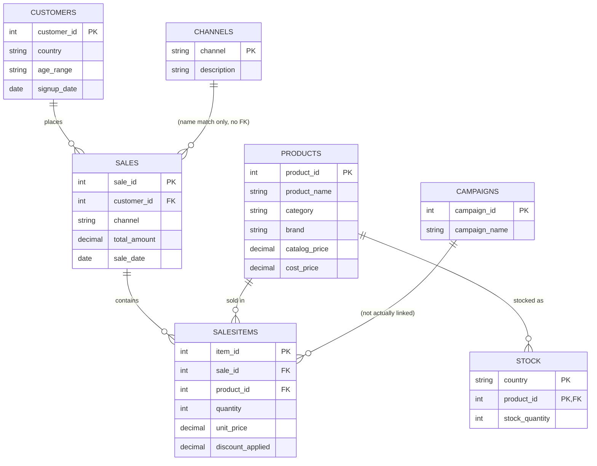

# Data Dictionary

Seven CSV tables, ~5,900 rows total. Grain and relationships below reflect what's actually in the files, not an idealized schema.

## customers.csv (1,000 rows)
| Column | Type | Notes |
|---|---|---|
| customer_id | INT (PK) | |
| country | VARCHAR | 6 values: France, Germany, Italy, Netherlands, Spain, Portugal |
| age_range | VARCHAR | Banded: 16-25, 26-35, 36-45, 46-55, 56-65 |
| signup_date | DATE | Ranges Jan 2024 – Jun 2025. Most customers signed up well before the sales window starts (Apr 2025), so acquisition-cohort analysis will be thin for early months. |

## products.csv (500 rows)
| Column | Type | Notes |
|---|---|---|
| product_id | INT (PK) | |
| product_name | VARCHAR | |
| category | VARCHAR | 5 values: Dresses, T-Shirts, Pants, Shoes, Sleepwear |
| brand | VARCHAR | **Single value ("Tiva") across all 500 rows.** Any brand-comparison query is unanswerable with this data — see README limitations. |
| color | VARCHAR | |
| size | VARCHAR | |
| catalog_price | DECIMAL(10,2) | List price |
| cost_price | DECIMAL(10,2) | Used for margin/profit calcs |
| gender | VARCHAR | **Single value ("Female") across all 500 rows.** No gender-based segmentation is possible. |

## sales.csv (905 rows)
| Column | Type | Notes |
|---|---|---|
| sale_id | INT (PK) | Order-level grain |
| channel | VARCHAR | E-commerce or App Mobile |
| discounted | INT (0/1) | Order-level flag |
| total_amount | DECIMAL(10,2) | Order total |
| sale_date | DATE | Range: 2025-04-04 to 2025-06-17 (~2.5 months) |
| customer_id | INT (FK → customers) | |
| country | VARCHAR | Denormalized copy of customer's country at time of sale |

## salesitems.csv (2,253 rows)
| Column | Type | Notes |
|---|---|---|
| item_id | INT (PK) | Line-item grain |
| sale_id | INT (FK → sales) | |
| product_id | INT (FK → products) | |
| quantity | INT | |
| original_price | DECIMAL(10,2) | |
| unit_price | DECIMAL(10,2) | Price actually charged |
| discount_applied | DECIMAL(10,2) | Numeric discount amount — this is what the SQL queries use |
| discount_percent | VARCHAR | **Stored as text with a `%` sign (e.g. "10.00%"), not numeric.** Needs `TRIM(discount_percent,'%')` + cast before any aggregate math. Not currently used in any query for this reason. |
| discounted | INT (0/1) | Line-level flag |
| item_total | DECIMAL(10,2) | quantity × unit_price |
| sale_date | DATE | Denormalized copy from sales |
| channel | VARCHAR | Denormalized copy from sales |
| channel_campaigns | VARCHAR | **Does not match `campaigns.campaign_name`.** Values are traffic-source labels (Email, Social Media, Website Banner, App Mobile), not actual campaign names. Treat as a separate "traffic source" attribute — it is not a usable FK into campaigns.csv. |

## stock.csv (1,000 rows)
| Column | Type | Notes |
|---|---|---|
| country | VARCHAR | Composite key with product_id |
| product_id | INT (FK → products) | |
| stock_quantity | INT | Point-in-time snapshot, not a time series. There's no stock date column, so this can only support a current-state view, not stock-over-time trending. |

## campaigns.csv (7 rows)
| Column | Type | Notes |
|---|---|---|
| campaign_id | INT (PK) | |
| campaign_name | VARCHAR | |
| start_date / end_date | DATE | |
| channel | VARCHAR | |
| discount_type | VARCHAR | Percentage or Fixed |
| discount_value | VARCHAR | **Mixed representation** — some rows store "10.00%" (text), others store a bare number like "10" (meant to be a fixed currency amount). Needs a `discount_type`-driven parse before use. |

**This table is currently orphaned — no column in `sales` or `salesitems` reliably joins to it.** It's included in the repo for completeness but isn't used in any query. If you want it usable, you'd need to either add a `campaign_id` FK to `sales` at data-generation time, or drop this table from the project scope and stop referencing "campaign performance" as an analysis area.

## channels.csv (2 rows)
| Column | Type | Notes |
|---|---|---|
| channel | VARCHAR (PK) | E-commerce, App Mobile |
| description | VARCHAR | Free-text description |

Purely descriptive lookup — `sales.channel` and `salesitems.channel` already carry the channel name directly, so this table is a "nice to have" for a dimension model, not something the business queries need to function.

## Entity Relationships

