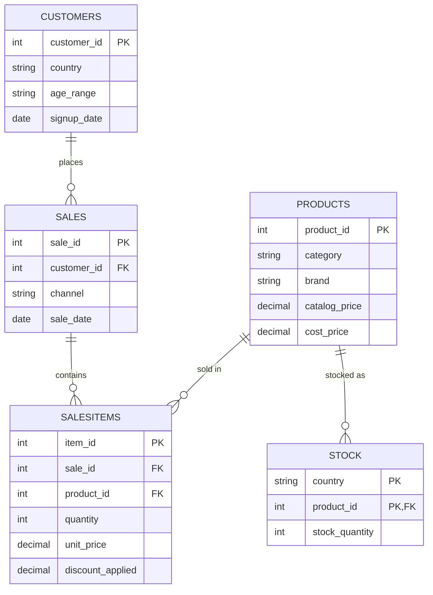

# FashionHub Retail Analytics

End-to-end retail analytics project: raw transactional data → SQL business logic → Power BI executive dashboard. Built around a single question senior leadership actually asks — *revenue is growing, so why isn't profit growing with it?*

## The Business Problem

FashionHub sells across two channels (E-commerce, App Mobile) in six European countries. Sales, Merchandising, and Inventory each report separately, so leadership has no single view of what's actually driving — or eroding — profit. Full write-up: [`04_Documentation/Business_Problem.md`](04_Documentation/Business_Problem.md).

## What's in this repo

```
FashionHub-Retail-Analytics/
├── README.md
├── LICENSE
├── .gitignore
│
├── 01_Dataset/
│   ├── customers.csv, products.csv, sales.csv, salesitems.csv, stock.csv,
│   │   campaigns.csv, channels.csv          (7 tables, ~5,900 rows)
│   └── Data_Dictionary.md                    (schema + known data quality notes)
│
├── 02_SQL/
│   ├── 01_Table_Creation.sql                 (T-SQL DDL matching the actual CSVs)
│   ├── 02_Business_Queries.sql               (revenue, profit, discount, customer,
│   │                                           channel, geography — organized by workstream)
│   └── 03_Inventory_Queries.sql              (dead stock / stockout risk — new, see below)
│
├── 03_PowerBI/
│   └── FashionHub_Retail_Analytics.pbix      (6-page executive dashboard)
│
└── 04_Documentation/
    ├── Business_Problem.md
    ├── KPI_Definitions.md
    └── Business_Insights_and_Recommendations.md   (real numbers, not placeholders)
```

## Data Model



`campaigns.csv` and `channels.csv` exist as reference tables but aren't wired into the transactional data — see [`Data_Dictionary.md`](01_Dataset/Data_Dictionary.md) for why.

## Dashboard

Six pages in `03_PowerBI/FashionHub_Retail_Analytics.pbix`:

1. **Executive Summary** — top-line KPI cards and trend
2. **Revenue and Profitability** — product/category/brand cut
3. **Customer Analytics** — age, country, top customers, acquisition timing
4. **Pricing and Discount Analysis** — discount bands vs. margin
5. **Channel & Geographic Analysis** — E-commerce vs. App Mobile, country scorecards
6. **Product Insights & Recommendations** — action list

## Key Findings

Full detail with every number in [`04_Documentation/Business_Insights_and_Recommendations.md`](04_Documentation/Business_Insights_and_Recommendations.md). Headlines:

- **Discounting above 10% is a clear net loss.** Margin drops from 44.9% (no discount) to 18.6–23.8% (21%+ discount bands), for only 96 units of extra volume out of 6,715 total.
- **E-commerce outperforms App Mobile on every metric while discounting ~9x less** (0.25% avg discount vs 2.18%).
- **Country and age aren't real differentiators** — margin is flat (43.3–44.7%) across both; revenue differences are pure customer-count differences.
- **349 of 1,000 stock lines are dead stock** (9,424 units, zero sales) while a separate set of products are already selling 13–17x their current stock — an inventory rebalancing problem that wasn't part of the original project scope but was sitting in the data.

## Tech Stack

SQL Server (T-SQL) · Power BI )
